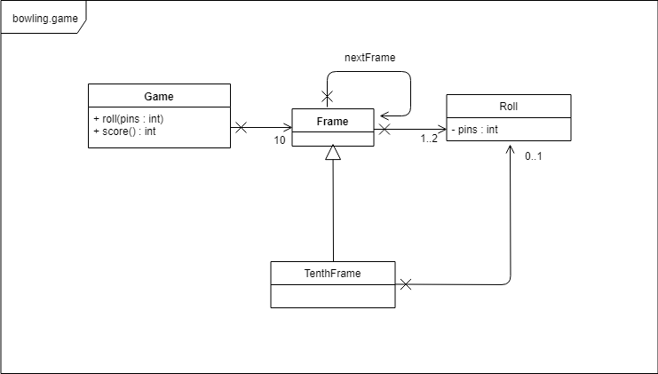

# Bowling Game

## Summary
TDD연습을 위한 Bowling Game 프로젝트입니다.

### Rules
- 볼링게임은 10개의 프레임으로 구성된다.
- 각 프레임은 10개의 핀을 쓰러뜨리기위해 최대 2번의 기회를 갖는다.
- 스페어 : 10 + next first roll에서 쓰러뜨린 핀 수
- 스트라이크 : 10 + next two rolls에서 쓰러뜨린 핀 수
- 10번째 프레임은 스페어 처리하면 3번 던질 수 있다.

### Purpose
- Game 클래스를 생성해야한다.
- Game 클래스는 *roll*과 *score*라는 2개의 메소드를 갖는다.
- *roll*은 ball을 roll할 때마다 호출된다. 인자로는 쓰러뜨린 핀 수를 갖는다.
- score 메소드는 게임이 끝난 후에만 호출되어 게임의 점수를 반환한다.

---
## 참고
[ 클린코더스 - 백명석님 (msbaek) ](https://www.youtube.com/user/codetemplate/videos)

